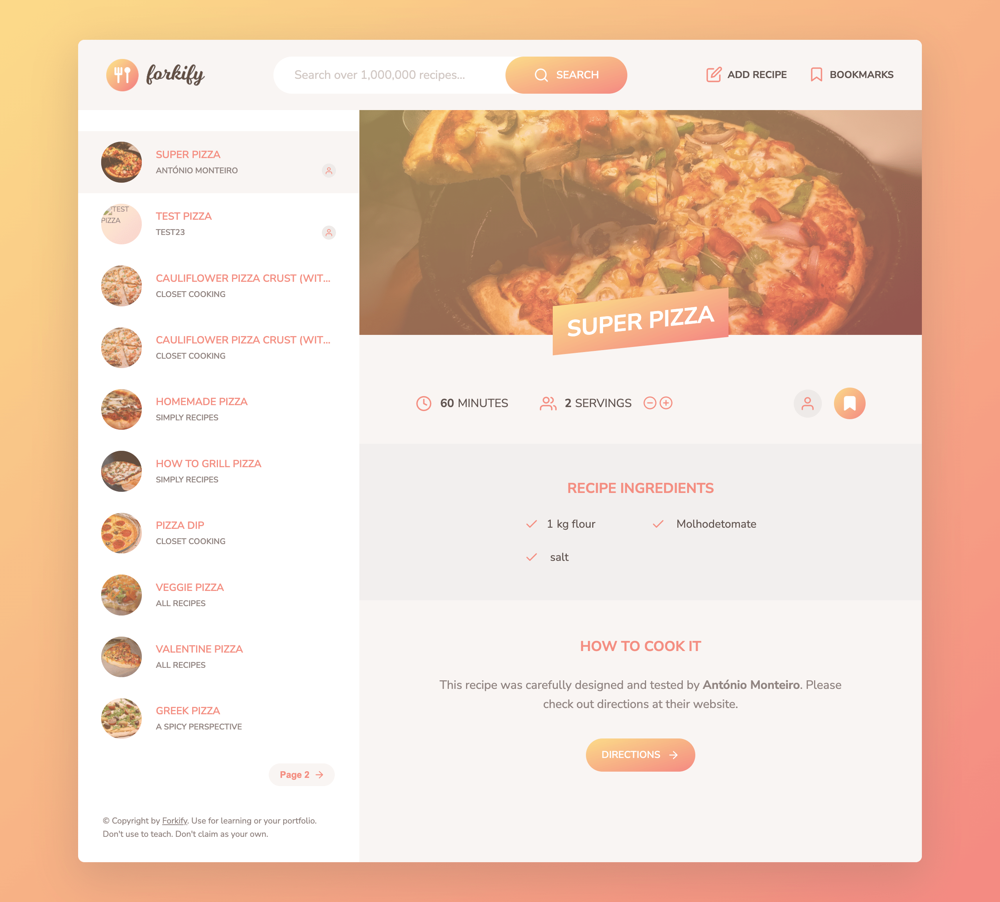

# forkify Project

Recipe application with custom recipe uploads.

## Habilidades
- OOP moderno: classes, construtores, herança prototípica, encapsulamento, etc.
- JavaScript assíncrono: loop de eventos, promessas, async/await, chamadas AJAX e APIs
- Paginação 
- Planejamento de projeto e mais

## 

Pode testar aqui [forkify-monteiro](https://forkify-monteiro.netlify.app/)

### Preview

